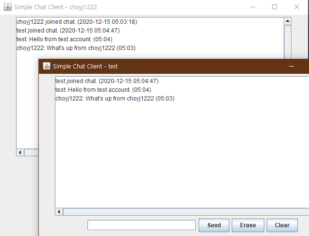
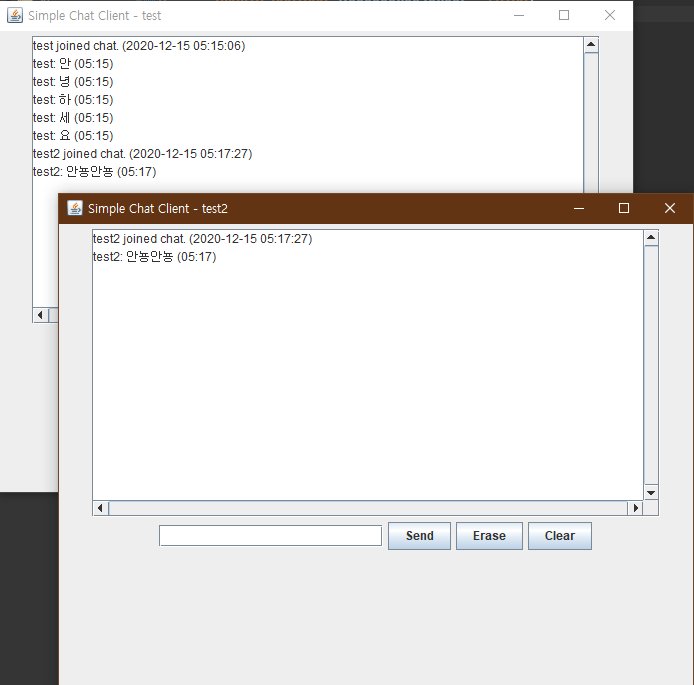

# SimpleChatClient & VerySimpleChatServer

- https://github.com/bethrobson/Head First Java/blob/master/chap15/VerySimpleChatServer.java
- https://github.com/bethrobson/Head First Java/blob/master/chap15/SimpleChatClient.java

주어진 오픈소스 채팅 프로그램의 서버와 클라이언트 코드를 통해 자신만의 채팅 프로그램을 만들어봅시다.

## 제약조건

1. 채팅방 입장시 ID를 생성하고 채팅 입력시 그 사람의 ID가 옆에 뜨게 하기. (ID 생성시 GUI를 통해 생성)
2. 채팅방 입장, 퇴장시 채팅창에 뜨게 하기
3. 채팅 옆에 현재 시간 출력하기
4. 그 외 기능 구현시 난이도에 따라 +0~2점 부여

## 결과화면

