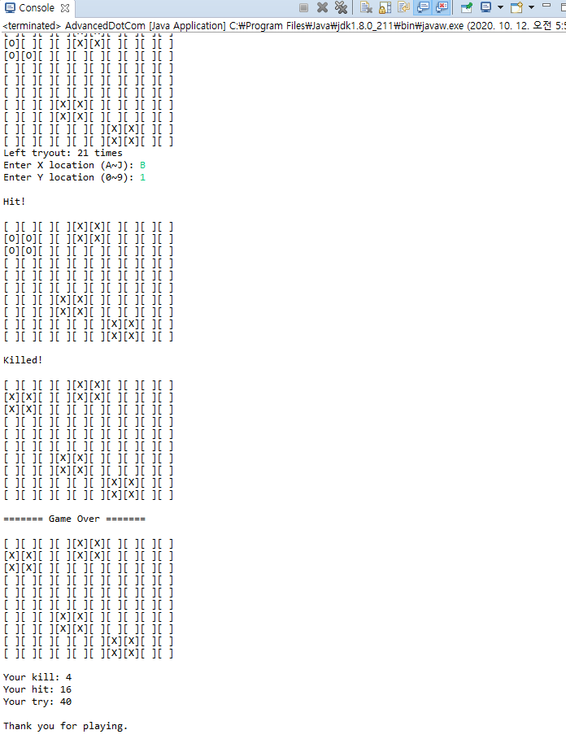

# DotComGame

교안에 나와있는 닷 컴 가라앉히기 게임을 만들어 봅시다

## 제약조건

1. Map Size = 10 * 10
2. 닷 컴의 개수 = 랜덤 3~5개
3. 닷 컴의 크기 = 정사각형 4칸
4. 닷 컴끼리 겹칠 수 없음
5. 좌표 입력 횟수에 제한이 있음 (50~70번)
6. 게임 종료 후 결과 화면을 출력해야 함

## 결과화면

