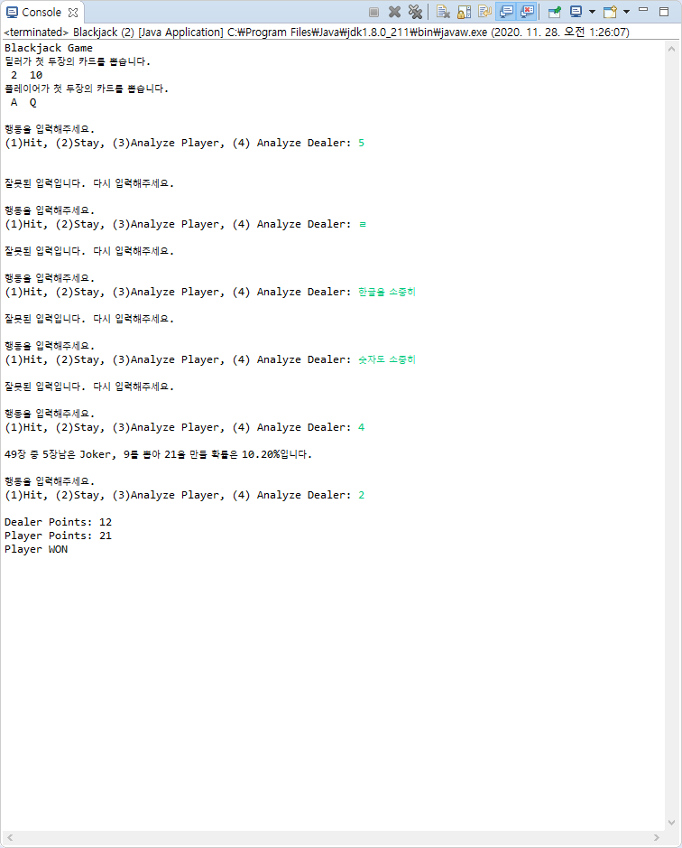
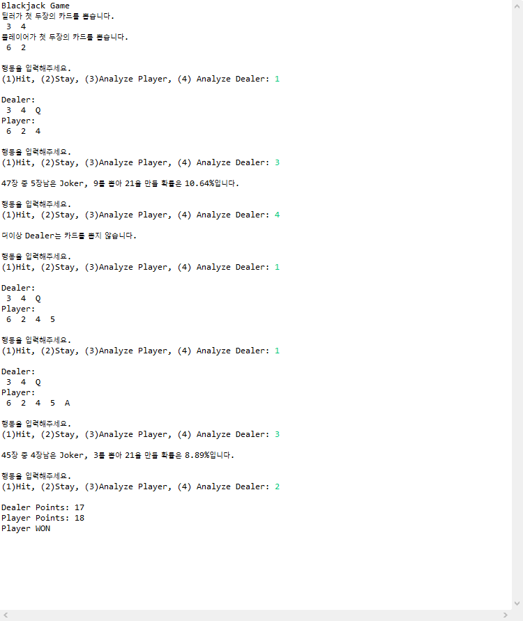

# Blackjack

11~13주차까지 진행되었던 블랙잭 게임을 만들어 봅시다

## 제약조건

1. 딜러와 플레이어 2명이 존재한다.
2. 카드는 조커를 포함한 53장이다.
3. 2~10은 숫자 그대로 점수를, K/Q/J는 10점, A는 1 또는 11, 조커는 가장 유리한 점수로 설정한다.
4. 게임 시작과 동시에 딜러와 게이머는 순차적으로 카드를 하나씩 뽑아 각자 2개의 카드를 소지한다.
5. 딜러부터 게임을 진행하며 딜러는 두개의 카드 합계 점수가 16점 이하이면 반드시 1장을 추가로 뽑고, 17점 이상이면 stay한다.
6. 플레이어는 얼마든지 추가로 카드를 뽑을 수 있다.
7. 양쪽 다 stay한 경우 딜러와 플레이어 중 소유한 카드의 합이 21에 가까운 쪽이 승리한다.
8. 단 21을 초과하면 초과한 쪽이 진다.
9. 딜러와 플레이어의 카드는 전부 오픈되어 있으며 플레이어는 블랙잭의 확률을 계산할 수 있어야 한다.
10. 딜러와 플레이어는 하나의 클래스를 사용하며 이 클래스 안에 해당 플레이어의 블랙잭 확률을 구하는 함수를 정적으로 만든다.
11. 게임에 사용되는 카드는 (String 배열) 정적 변수를 사용한다.
12. try-catch 문을 사용하여 플레이어가 카드를 받을지 말지 결정하는 단계에서 그 이외의 선택지를 고를 경우 에러를 발생시켜 catch 문에서 경고문을 작성하고, 제대로 된 명령이 들어올 때까지 반복한다.
13. 게임 시작시, 플레이어가 카드를 받겠다고 한 경우, 플레이어가 이길 때, 졌을 때 소리를 추가하여 재생한다.

## 결과화면

